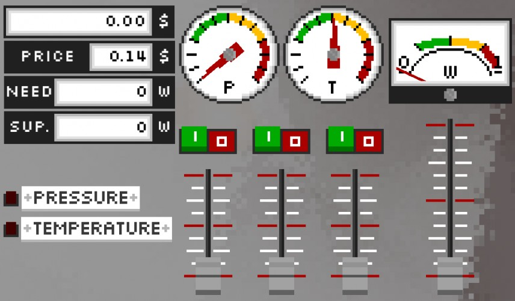

# Nuclear Power Plant Simulator 2014

This is the source code repository for my Ludum Dare 31 Compo entry - [Nuclear Power Plant Simulator 2014](http://ludumdare.com/compo/ludum-dare-31/?action=preview&uid=46047)

## Info

This game was made in 48 hours for the Ludum Dare event. It was build using the Unity Game Engine.
It's a Nuclear Power Plant control simulation game which was inspired by the [AKW Simulator from BackendButters](https://github.com/BackendButters/AKW-Simulator).

## Links

[Nuclear Power Plant Simulator 2014 Ludum Dare page](http://ludumdare.com/compo/ludum-dare-31/?action=preview&uid=46047)
